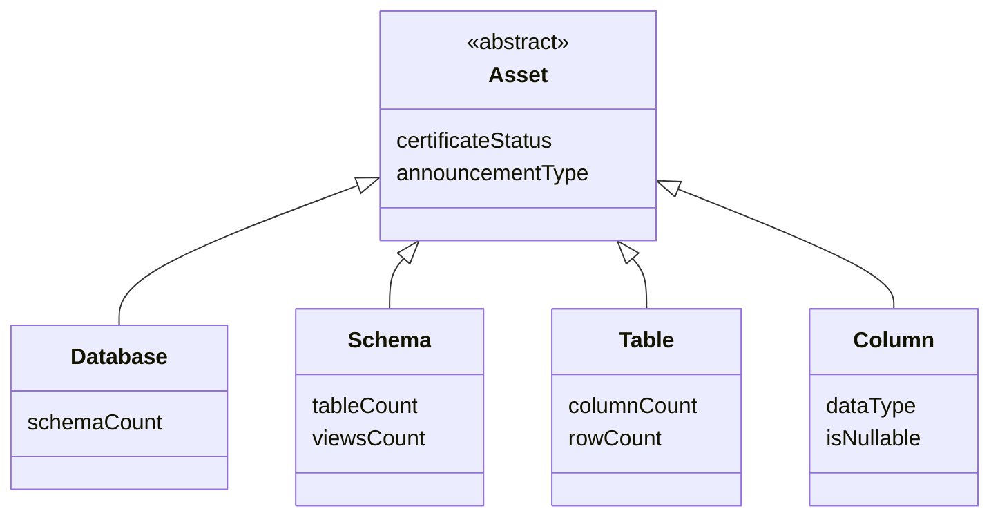

---
hide:
  - toc
---

# Assets

In Atlan, we refer to all objects that provide context to your data as *assets*.

Assets are a kind of [entity](../entities) in Atlan. They are an abstract concept used to describe the common characteristics of objects in Atlan, such as certificates and announcements. (The specific characteristics for both this abstract concept and the more detailed objects in Atlan are described through [type definitions](../typedefs).)

