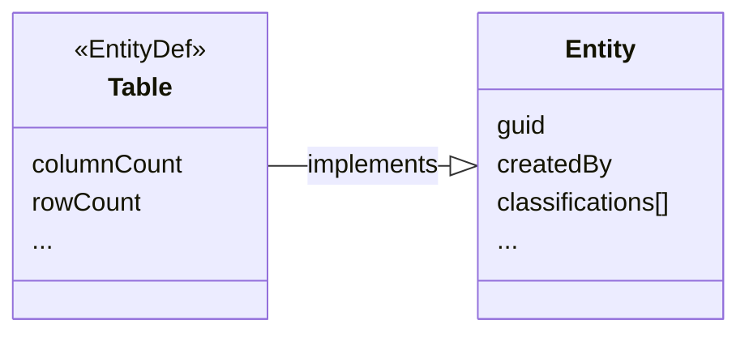

---
hide:
  - toc
---

# Entities

Atlan is built on [Apache Atlas :material-dock-window:](https://atlas.apache.org){ target=aa }, so we borrow some of its terminology, like *entities*.

Entities define the core objects of metadata. For example, databases, tables, views, dashboards, glossary terms, categories, and even glossaries themselves are all entities. Every entity has:

- a unique identifier (`guid`)
- maintenance details (`createdBy`, `updatedBy`, `createTime`, and so on)
- (optional) one or more classifications

As an abstract concept, entities allow APIs to treat all of these objects in a similar way. You can think of it as a meta-model of sorts. This means that as we extend the objects that Atlan supports, we do not need to change the APIs or integration interfaces. The two are loosely-coupled, giving us much greater flexibility to evolve.

The structure of each of these objects is defined by a kind of [type definition](../typedefs) called an `EntityDef`.

