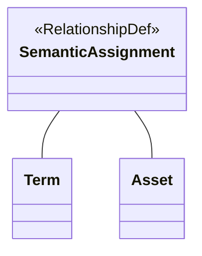

---
hide:
  - toc
---

# Relationships

Atlan is built on [Apache Atlas :material-dock-window:](https://atlas.apache.org){ target=aa }, so we borrow some of its terminology, like *relationships*.

Relationships define a linkage between two [entities](../entities). For example, the *linked assets* you see on a glossary term are each a relationship — between the glossary term and another [asset](../assets). Every relationship has:

- a unique identifier (`guid`)
- exactly two entities that are linked

!!! recommendation "Unlike entities, relationships cannot have classifications"

As an abstract concept, relationships allow APIs to treat all of these linkages in a similar way. You can think of it as a meta-model of sorts. This means that as we extend the linkages that can exist between objects in Atlan, we do not need to change the APIs or integration interfaces. The two are loosely-coupled, giving us much greater flexibility to evolve.

The structure of each of these objects is defined by a kind of [type definition](../typedefs) called a `RelationshipDef`.

