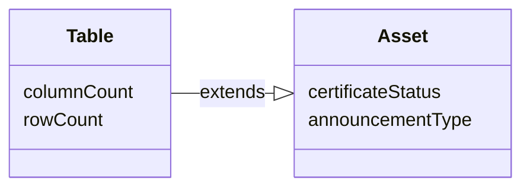

---
hide:
  - toc
---

# Type definitions

Type definitions (or *typedefs* for short) describe the objects that exist in Atlan. Think of them as describing the underlying *data model* of Atlan itself.

For example:

- The model for database tables in Atlan is defined by the `Table` typedef.
- The `Table` typedef describes characteristics unique to database tables, such as column counts and row counts.

Type definitions also inherit from other type definitions.

For example:

- The `Table` typedef inherits from an `Asset` typedef. (As do most other objects in Atlan.)
- The `Asset` typedef describes characteristics that apply to all of these objects, such as certificates and announcements.

