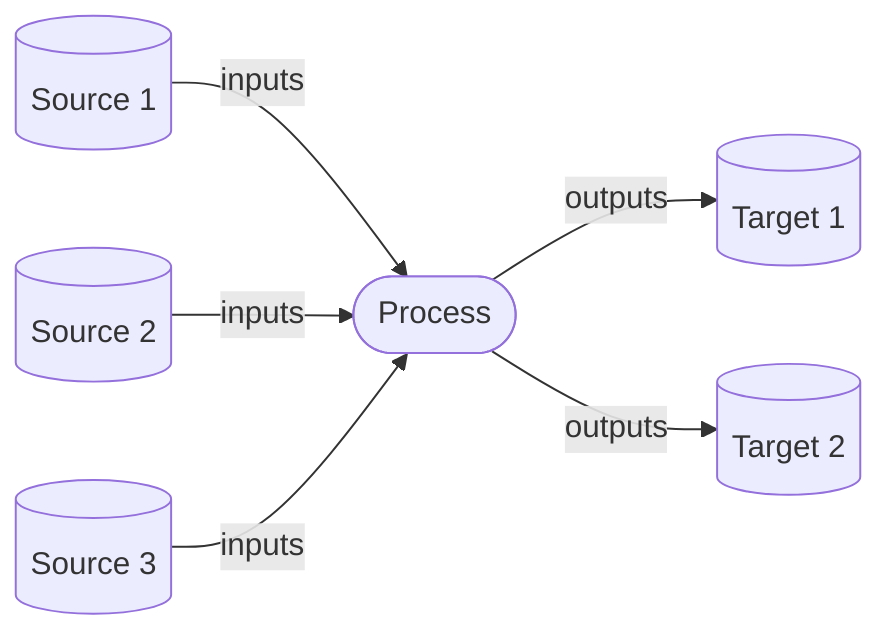

# Manage lineage

Lineage in Atlan is defined by `Process` entities. These link [assets](/concepts/assets) together by `inputs` and `outputs`, and there can be any number of each of these:



## Create lineage between assets

To create lineage between [assets](/concepts/assets), we need to create a `Process` entity.

!!! warning "Input and output assets must already exist"
	Note that the [assets](/concepts/assets) you reference as the inputs and outputs of the process must already exist, before creating the process.

=== ":fontawesome-brands-java: Java"

	```java linenums="1" title="Create lineage between assets"
	LineageProcess process = LineageProcess.toCreate( // (1)
            "Source 1, Source 2, Source 3 -> Target 1, Target 2", // (2)
            "snowflake", // (3)
            "development", // (4)
            "default/snowflake/1657025257", // (5)
            List.of( // (6)
            	Reference.to(Table.TYPE_NAME, "495b1516-aaaf-4390-8cfd-b11ade7a7799"),
            	Reference.to(Table.TYPE_NAME, "d002dead-1655-4d75-abd6-ad889fa04bd4"),
            	Reference.by(Table.TYPE_NAME, "default/snowflake/1657025257/OPS/DEFAULT/RUN_STATS")),
            List.of( // (7)
            	Reference.to(Table.TYPE_NAME, "86d9a061-7753-4884-b988-a02d3954bc24"),
            	Reference.by(Table.TYPE_NAME, "default/snowflake/1657025257/OPS/DEFAULT/FULL_STATS")));
	EntityMutationResponse response = process.upsert(); // (8)
	response.getCreatedEntities().size() == 1 // (9)
	response.getUpdatedEntities().size() == 5 // (10)
	```
	
	1. Use the `toCreate()` method to initialize the object with all [necessary attributes for creating it](../../java/basic-operations/create/#build-minimal-object-needed).
	2. Provide a name for how the process will be shown in the UI.
	3. Define the connector that ran the process.
	4. Define the connection that ran the process.
	5. Provide the `qualifiedName` of the connection that ran the process.
	6. Provide the list of inputs to the process. Note that each of these is only a `Reference` to an [asset](/concepts/assets), not a full [asset](/concepts/assets) object. For a reference we only need:

		- the type of [asset](/concepts/assets), and either:
			- its GUID (for the static `Reference.to()` method)
			- its `qualifiedName` (for the static `Reference.by()` method)

	7. Provide the list of outputs to the process. Note that each of these is again only a `Reference` to an [asset](/concepts/assets).
	8. Call the `upsert()` method to actually create the process.
	9. The response will include that single [asset](/concepts/assets) that was created.
	10. The response will also include the 5 data [assets](/concepts/assets) (3 inputs, 2 outputs) that were updated.

=== ":material-language-python: Python"

	!!! construction "Coming soon"

## Remove lineage between assets

To remove lineage between [assets](/concepts/assets), we need to delete the `Process` entity that links them:

=== ":fontawesome-brands-java: Java"

	```java linenums="1" title="Remove lineage between assets"
	EntityMutationResponse response =
			Entity.purge("b4113341-251b-4adc-81fb-2420501c30e6"); // (1)
	Entity deleted = response.getDeletedEntities().get(0); // (2)
	Process process;
	if (deleted instanceof Process) {
		process = (Process) deleted; // (3)
	}
	```
	
	1. Provide the GUID for the process to the static `Entity.purge()` method.
	2. The response will include that single process that was purged.
	3. If you want to confirm the details, you'll need to type-check and then cast the generic `Entity` returned into a `Process`.

=== ":material-language-python: Python"

	!!! construction "Coming soon"

??? details "More information"
	This will irreversibly delete the process, and therefore the lineage it represented. The input and output [assets](/concepts/assets) themselves will also be updated, to no longer be linked to the (now non-existent) process. However, the input and output [assets](/concepts/assets) themselves will continue to exist in Atlan.
